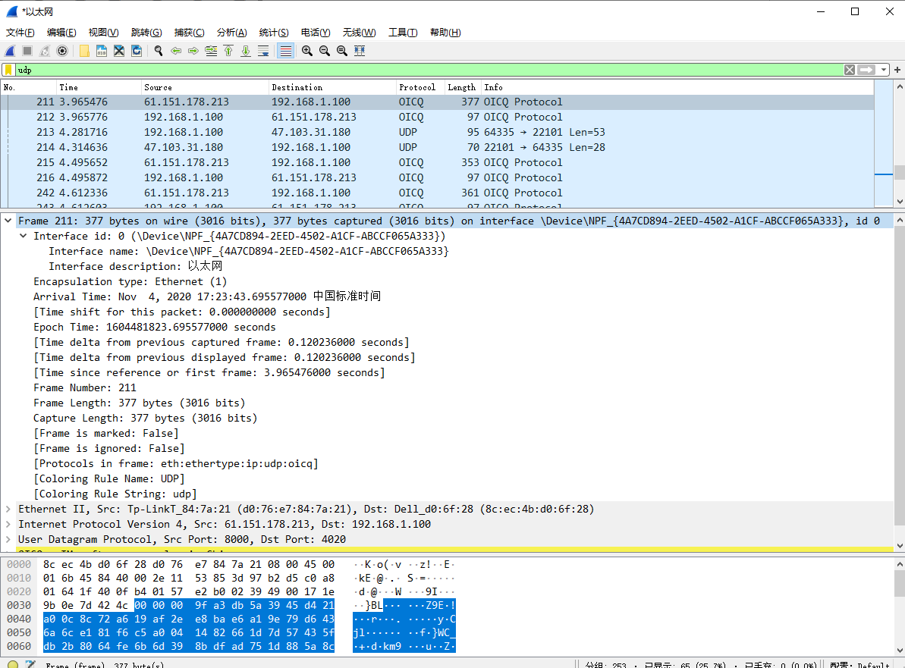
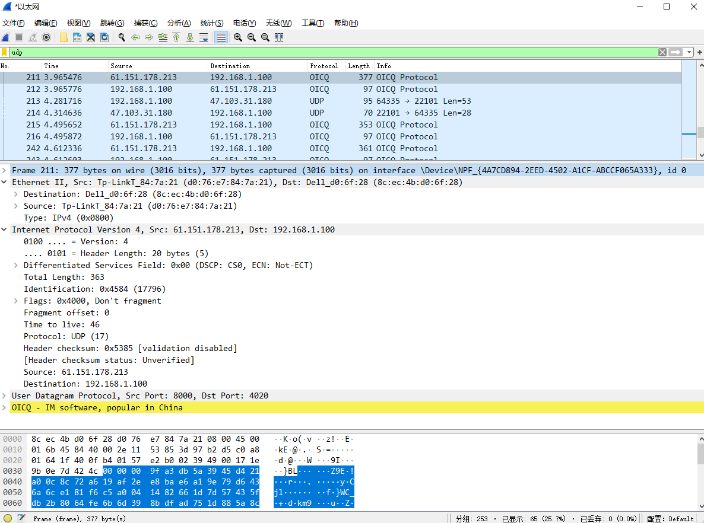
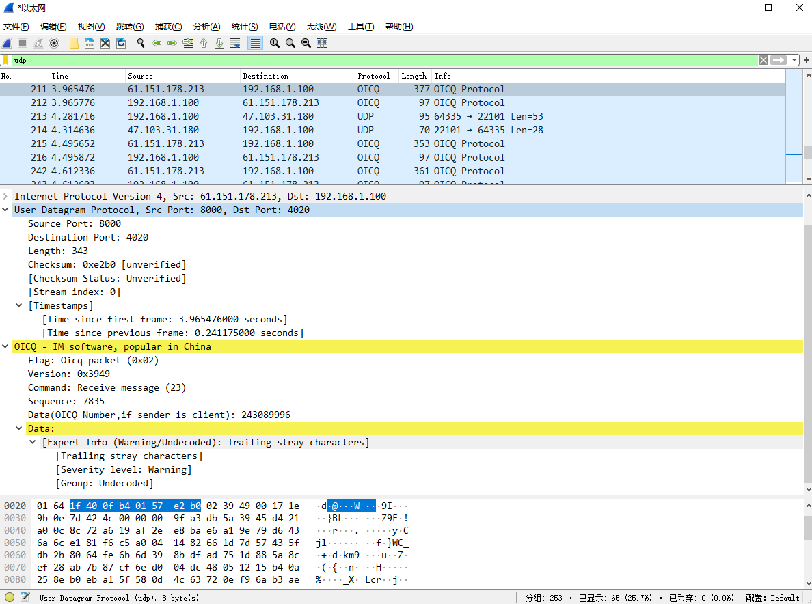

# 实验一 UDP报文格式抓包分析和IP层协议格式分析
## 使用Wireshark抓包分析UDP协议，抓包如下

* 通过添加udp筛选，抓取了一些包，在列表区可以看到这次抓取过程中每个包的编号、时间、来源和去向IP、协议、长度、信息。
* 在数据包详细区由上到下分别为：
1. Frame 211:物理层的数据帧概况
2. Ethernet II:数据链路层以太网帧头部信息，可以看到路由信息
3. Internet Protocol Version 4:网络层IP包头部信息，此处是IPv4
4. User Datagram Protocol:传输层的数据段头部信息，此处是UDP
5. OICQ：应用层信息，此处是QQ定义的应用层协议
* 在数据包详细区点击某一个字段可以在数据包字节区查看具体的数据信息

## 物理层的数据帧分析

	#211号帧，线路377字节，实际捕获3377字节，接口id
	Frame 211: 377 bytes on wire (3016 bits), 377 bytes captured (3016 bits) on interface \Device\NPF_{4A7CD894-2EED-4502-A1CF-ABCCF065A333}, id 0
	#接口id
    Interface id: 0 (\Device\NPF_{4A7CD894-2EED-4502-A1CF-ABCCF065A333})
		#接口名 、接口描述
        Interface name: \Device\NPF_{4A7CD894-2EED-4502-A1CF-ABCCF065A333}
        Interface description: 以太网
	#封装类型
    Encapsulation type: Ethernet (1)
	#获取日期和时间
    Arrival Time: Nov  4, 2020 17:23:43.695577000 中国标准时间
    [Time shift for this packet: 0.000000000 seconds]
	#从新纪元时间1970-01-01 00:00:00 UTC算起的时间
    Epoch Time: 1604481823.695577000 seconds
	#此包与前一包和第一包的时间间隔
    [Time delta from previous captured frame: 0.120236000 seconds]
    [Time delta from previous displayed frame: 0.120236000 seconds]
    [Time since reference or first frame: 3.965476000 seconds]
    Frame Number: 211  #帧序号
    Frame Length: 377 bytes (3016 bits)  #帧长度
    Capture Length: 377 bytes (3016 bits) #捕获长度
    [Frame is marked: False]  #此帧是否做了标记：否
    [Frame is ignored: False]  #此帧是否被忽略：否
    [Protocols in frame: eth:ethertype:ip:udp:oicq]  #帧内封装的协议层次结构
    [Coloring Rule Name: UDP] #着色标记的协议名称
    [Coloring Rule String: udp] #着色规则显示的字符串，也就是筛选器

## 数据链路层分析
	
	#路由信息，来源Tp-LinkT_84:7a:21 (MAC地址d0:76:e7:84:7a:21)，到达Dell_d0:6f:28 (MAC地址8c:ec:4b:d0:6f:28)
	Ethernet II, Src: Tp-LinkT_84:7a:21 (d0:76:e7:84:7a:21), Dst: Dell_d0:6f:28 (8c:ec:4b:d0:6f:28)
	Destination: Dell_d0:6f:28 (8c:ec:4b:d0:6f:28)
    Source: Tp-LinkT_84:7a:21 (d0:76:e7:84:7a:21)
    Type: IPv4 (0x0800) #网络层类型为IPv4
	
## 网络层分析

	#IPV4 源地址IP：61.151.178.213 目标地址IP：192.168.1.100
	Internet Protocol Version 4, Src: 61.151.178.213, Dst: 192.168.1.100
    0100 .... = Version: 4 #IP协议版本
    .... 0101 = Header Length: 20 bytes (5) #IPv4的首部长度 20字节=5*4
	# DS：区分服务 代码点，用来指定特殊的数据包处理方式以获得更好的服务。
    Differentiated Services Field: 0x00 (DSCP: CS0, ECN: Not-ECT)
    Total Length: 363 #指首部和数据的总长度 363
	#IPv4在存储器中维持一个计数器，每产生一个数据包，计数器加一，把值赋给该字段作为标识，共8字节。
    Identification: 0x4584 (17796)
	#目前只有两位有意义。最低位为1表示后面“还有分片”的数据报，为0表示这已经是最后一个数据片；中间一位为1表示“不能分片”，为0才允许分片。
    Flags: 0x4000, Don't fragment
	#片偏移：13位，较长的分组在经过通信链路中因为分组过大进行分片，分片后在原分组中的相对位置。片偏移以8字节为偏移单位
    Fragment offset: 0
	#生存时间：表示数据包在网络中的寿命，缩写TTL，功能是“跳数限制”
    Time to live: 46
    Protocol: UDP (17) #指出此数据包携带数度的协议为UDP
	#首部效验和：数据包每经过一个路由器，路由器都要重新计算一下首部检验和，这里并核实。
	#若首部未发生变化，则此结果必为0，于是就保留这个数据报。这个字段只检验数据报的首部，但不包括数据部分。
    Header checksum: 0x5385 [validation disabled]
    [Header checksum status: Unverified]
    Source: 61.151.178.213 #源IP
    Destination: 192.168.1.100 #目标IP

## 传输层分析

	#UDP协议,源端口:8000, 目标端口:4020
	User Datagram Protocol, Src Port: 8000, Dst Port: 4020
    Source Port: 8000
    Destination Port: 4020
    Length: 343 #数据报文长度:343字节
    Checksum: 0xe2b0 [unverified] #校验和，并核实
    [Checksum Status: Unverified]
    [Stream index: 0]
	#此包与第一包和前一包的时间戳间隔
    [Timestamps]
        [Time since first frame: 3.965476000 seconds]
        [Time since previous frame: 0.241175000 seconds]

## 应用层分析OICQ

	OICQ - IM software, popular in China
    Flag: Oicq packet (0x02) #标识
    Version: 0x3949 #版本号
    Command: Receive message (23) #命令字，这里是接收信息
    Sequence: 7835 #序号
    Data(OICQ Number,if sender is client): 243089996 #我的QQ号
    Data:  #具体数据
        [Expert Info (Warning/Undecoded): Trailing stray characters]
            [Trailing stray characters]
            [Severity level: Warning]
            [Group: Undecoded]