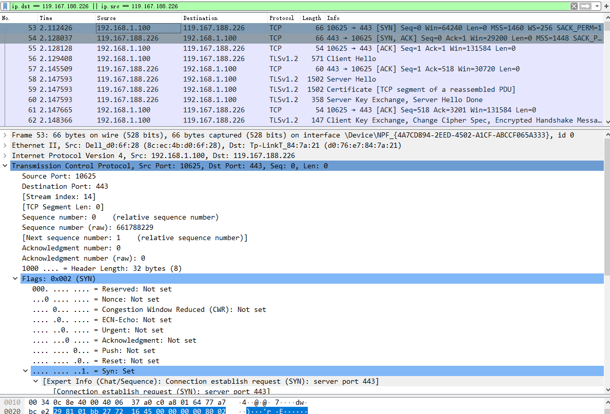
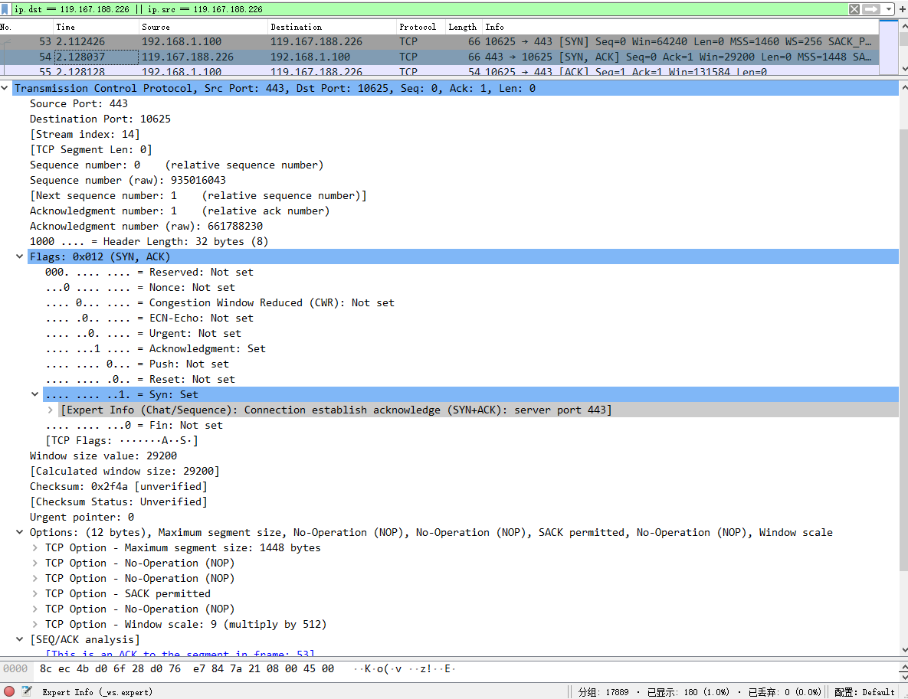
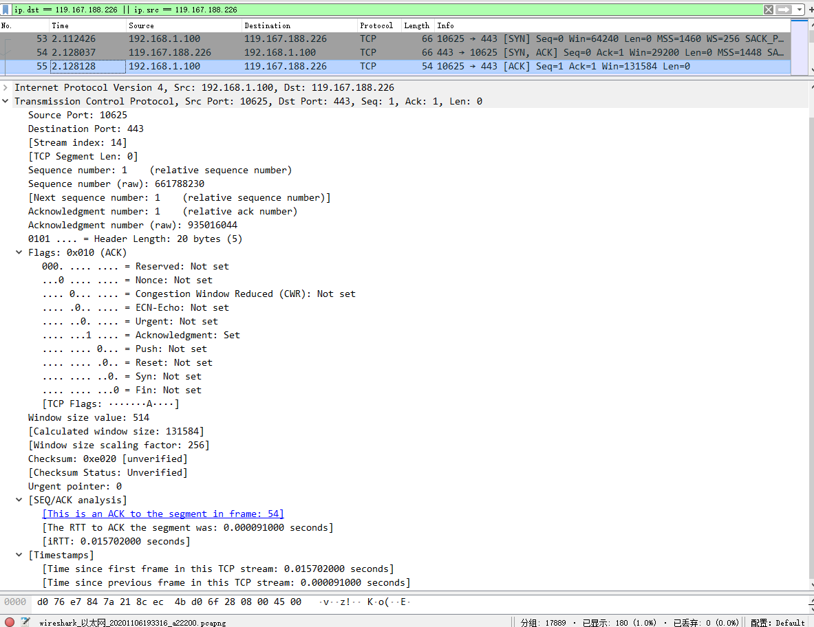
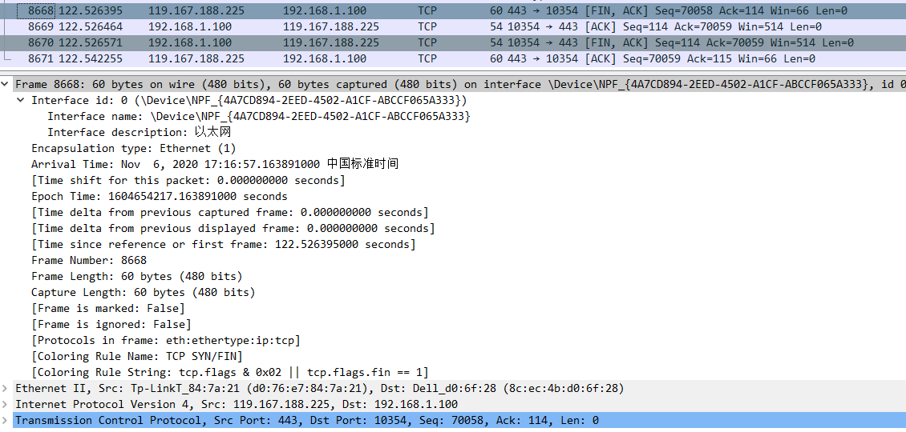
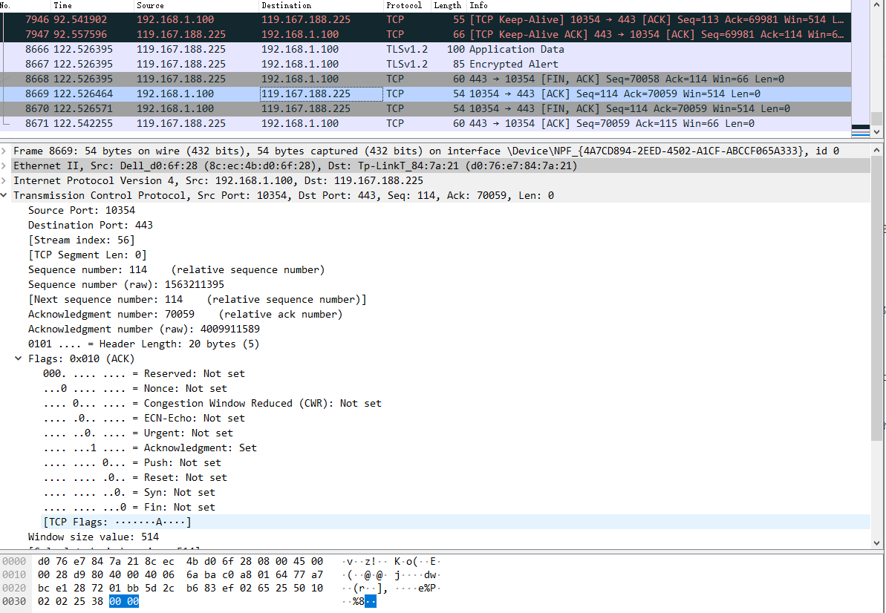
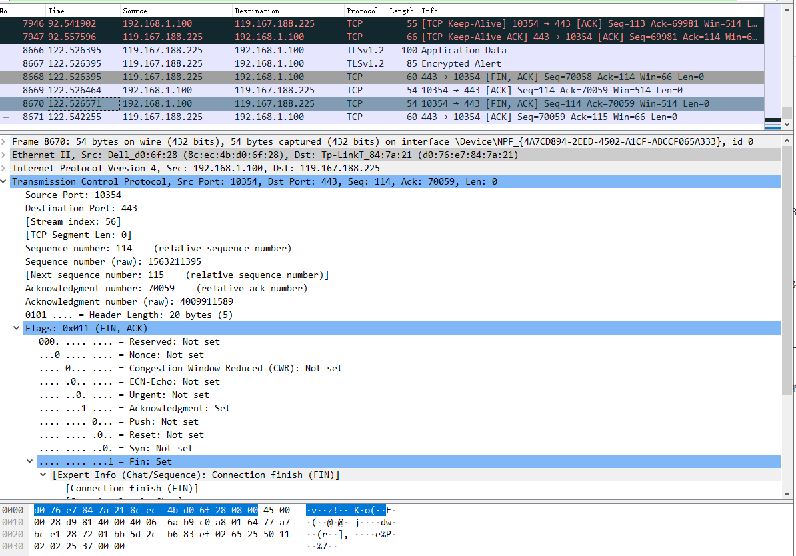

# 实验二 任意网站三次握手过程和四次挥手过程抓包分析

使用wireshark抓取网页打开和关闭[飞书主页](https://www.feishu.cn)时的TCP报文分析。

两次抓包时飞书的ip分别为`119.167.188.226`和`119.167.188.225`

## TCP的三次握手

## 使用Wireshark抓包分析TCP三次握手，抓包如下

可以看到192.168.1.100（客户端）通过10625端口发送TCP包到119.167.188.226（服务器端）的443端口（https默认端口），经过TCP三次握手后客户端和服务器互相Say Hello，与HTTPS站点之间使用[1.2版本的的TLS协议](http://www.ietf.org/rfc/rfc5246.txt)继续握手，通过证书认证来确认对方的身份，交换密钥。

首先从抓包列表中可以看到，此次开始信息是符合TCP三次握手的操作的。

1. 192.168.1.100（客户端）通过10625端口发送TCP包到119.167.188.226（服务器端）的443端口（https默认端口），请求开启连接。
	* 其中包含了SYN标志，表明自己已经进入了SYN-SENT状态。
	* 此次消息在客户端的序列Seq=0，由于之前从未连接过，所以并未携带确认序号ACK。
2. 服务器端给客户端回复TCP包，表明确认收到了客户端想要开启连接的意图。
	* 其中包含了SYN标志，表明自己已经进入了SYN-RCVD状态。
	* 消息序号Seq=0，期望收到客户端的消息序号ACK为1，即上一个包中客户端的Seq（0）+1，这就是TCP确保消息序列的顺序可靠性的实现。
3. 客户端给服务器端回复TCP包，表明确认收到了服务器端刚刚发来的确认信息。
	* 此时客户端已经认为与服务器端建立了连接，后续可以进行数据传输。
	* 消息序号Seq=1为上一次服务器端发来的包中的ACK；期望收到对方的消息序号ACK=1为上一次服务器端发来的包中的Seq+1。
	* 经过网路传输后，服务器端收到此包后建立连接。
 
## 三次握手的包内传输层分别如下图

TCP和UDP不同的在于传输层部分，由于第一个实验已经分析过其他部分，此处只分析传输层部分。

第一个包的传输层头部分析：

	#TCP协议,源端口:10625, 目标端口:443, 源序号Seq=0，报文无内容只有头部，所以长度为0
	Transmission Control Protocol, Src Port: 10625, Dst Port: 443, Seq: 0, Len: 0
    Source Port: 10625
    Destination Port: 443
    [Stream index: 14]
    [TCP Segment Len: 0]
    Sequence number: 0    (relative sequence number)
    Sequence number (raw): 661788229 #32位序号
    [Next sequence number: 1    (relative sequence number)]
    Acknowledgment number: 0
    Acknowledgment number (raw): 0
	#4位首部长度，长度为32字节
    1000 .... = Header Length: 32 bytes (8)
	#标志位，其中前3位为预留字段（Reserved field），值全为零。预留给以后使用。
    Flags: 0x002 (SYN)
        000. .... .... = Reserved: Not set #保留字段，预留给以后使用。
		#当前TCP首部中有9个标志比特。它们中的多个可同时被设置为1。
        ...0 .... .... = Nonce: Not set #该标签用来保护不受发送者发送的突发的恶意隐藏报文的侵害。
        .... 0... .... = Congestion Window Reduced (CWR): Not set #发送者在接收到一个带有ECE flag包时，将会使用CWR flag。
        .... .0.. .... = ECN-Echo: Not set #ECN表示Explicit Congestion Notification。表示TCP peer有ECN能力。
        .... ..0. .... = Urgent: Not set #是否使用紧急指针
        .... ...0 .... = Acknowledgment: Not set #确认序号
        .... .... 0... = Push: Not set #催促接收方应该尽快将这个报文段交给应用层
        .... .... .0.. = Reset: Not set #重建连接
        .... .... ..1. = Syn: Set #同步序号，用来发起一个连接
            [Expert Info (Chat/Sequence): Connection establish request (SYN): server port 443]
        .... .... ...0 = Fin: Not set #结束信号，发端完成发送任务
        [TCP Flags: ··········S·]
	#窗口（Window）：长度2个字节。表示滑动窗口的大小，用来告诉发送端接收端的buffer space的大小。接收端buffer大小用来控制发送端的发送数据数率，从而达到流量控制。最大值为65535.
    Window size value: 64240
    [Calculated window size: 64240]
	#校验和（Checksum）：长度2个字节。用来检查TCP头在传输中是否被修改。
    Checksum: 0x1496 [unverified]
    [Checksum Status: Unverified]
	#紧急指针（Urgent pointer）：长度为2个字节。表示TCP片中第一个紧急数据字节的指针。只有当前面的标志位中的URG标志置1时紧急指针才有效。
    Urgent pointer: 0
	#TCP选项，长度不定，但必须是4字节的整数倍，此处为12字节长度。
    Options: (12 bytes), Maximum segment size, No-Operation (NOP), Window scale, No-Operation (NOP), No-Operation (NOP), SACK permitted
		#最大片段长度，指明本端可以接受的最大长度的TCP Segment（Payload，不含TCP Header），也就是说，对端发送数据的长度不应该大于MSS（单位Byte）。
        TCP Option - Maximum segment size: 1460 bytes #最大可接受片段长度1460字节，此选项占据了4个字节
        TCP Option - No-Operation (NOP) #无意义，主要是填充整体长度至4字节的整数倍，占据1个字节
		#将TCP Header的Window Size字段从16bit扩展至最多30bit。
        TCP Option - Window scale: 8 (multiply by 256) #此处为扩展了8bit，数据容量乘以256，此选项占据3字节
        TCP Option - No-Operation (NOP) #无意义，主要是填充整体长度至4字节的整数倍，占据1个字节
        TCP Option - No-Operation (NOP) #无意义，主要是填充整体长度至4字节的整数倍，占据1个字节
		#TCP收到乱序数据后，会将其放入乱序队列中，然后发送重复ACK给对端。对端收到多个重复的ACK后，就会推测到可能发生了数据丢失，再重传数据。如果乱序的数据比较零散，则这种机制的效率会很低。使用SACK选项可以告知发包方收到了哪些数据，发包方收到这些信息后就会知道哪些数据丢失，然后立即重传缺失部分即可。这就大大提高了数据重传的速度。
        TCP Option - SACK permitted #若要使用SACK特性，必须在建立连接时，在SYN Segment中附加上SACK-Permitted Option，以此告知对方自己支持SACK，此选项占据2字节。
	#此包与第一包和前一包的时间戳间隔
    [Timestamps]
        [Time since first frame in this TCP stream: 0.000000000 seconds]
        [Time since previous frame in this TCP stream: 0.000000000 seconds]
		

第二个包的传输层头部分析，仅分析不同之处：

	#TCP协议,源端口:443, 目标端口:10625, 源序号Seq=0，确认序号ACK=1，长度为0
	Transmission Control Protocol, Src Port: 443, Dst Port: 10625, Seq: 0, Ack: 1, Len: 0
    Source Port: 443
    Destination Port: 10625
    [Stream index: 14]
    [TCP Segment Len: 0]
    Sequence number: 0    (relative sequence number)
    Sequence number (raw): 935016043
    [Next sequence number: 1    (relative sequence number)]
    Acknowledgment number: 1    (relative ack number)
    Acknowledgment number (raw): 661788230 #32位确认序号
    1000 .... = Header Length: 32 bytes (8)
    Flags: 0x012 (SYN, ACK)
        000. .... .... = Reserved: Not set
        ...0 .... .... = Nonce: Not set
        .... 0... .... = Congestion Window Reduced (CWR): Not set
        .... .0.. .... = ECN-Echo: Not set
        .... ..0. .... = Urgent: Not set
        .... ...1 .... = Acknowledgment: Set #此处表明有ACK标志
        .... .... 0... = Push: Not set
        .... .... .0.. = Reset: Not set
        .... .... ..1. = Syn: Set #同步序号，用来发起连接
            [Expert Info (Chat/Sequence): Connection establish acknowledge (SYN+ACK): server port 443]
        .... .... ...0 = Fin: Not set
        [TCP Flags: ·······A··S·]
    Window size value: 29200
    [Calculated window size: 29200]
    Checksum: 0x2f4a [unverified]
    [Checksum Status: Unverified]
    Urgent pointer: 0
    Options: (12 bytes), Maximum segment size, No-Operation (NOP), No-Operation (NOP), SACK permitted, No-Operation (NOP), Window scale
        TCP Option - Maximum segment size: 1448 bytes #最大可接受片段长度1448字节，此选项占据了4个字节
        TCP Option - No-Operation (NOP)
        TCP Option - No-Operation (NOP)
        TCP Option - SACK permitted #以此告知对方自己支持SACK，此选项占据2字节。
        TCP Option - No-Operation (NOP)
        TCP Option - Window scale: 9 (multiply by 512) #此处为扩展了9bit，数据容量乘以512，此选项占据3字节
    [SEQ/ACK analysis]
    [Timestamps]
        [Time since first frame in this TCP stream: 0.015611000 seconds]
        [Time since previous frame in this TCP stream: 0.015611000 seconds]
	
	

第三个包的传输层头部分析，仅分析不同之处：

	#TCP协议,源端口:10625, 目标端口:443, 源序号Seq=1，确认序号ACK=1，长度为0
	Transmission Control Protocol, Src Port: 10625, Dst Port: 443, Seq: 1, Ack: 1, Len: 0
    Source Port: 10625
    Destination Port: 443
    [Stream index: 14]
    [TCP Segment Len: 0]
    Sequence number: 1    (relative sequence number)
    Sequence number (raw): 661788230
    [Next sequence number: 1    (relative sequence number)]
    Acknowledgment number: 1    (relative ack number)
    Acknowledgment number (raw): 935016044
    0101 .... = Header Length: 20 bytes (5)
    Flags: 0x010 (ACK)
        000. .... .... = Reserved: Not set
        ...0 .... .... = Nonce: Not set
        .... 0... .... = Congestion Window Reduced (CWR): Not set
        .... .0.. .... = ECN-Echo: Not set
        .... ..0. .... = Urgent: Not set
        .... ...1 .... = Acknowledgment: Set
        .... .... 0... = Push: Not set
        .... .... .0.. = Reset: Not set
        .... .... ..0. = Syn: Not set #没有了同步序号SYN
        .... .... ...0 = Fin: Not set
        [TCP Flags: ·······A····]
    Window size value: 514
    [Calculated window size: 131584]
    [Window size scaling factor: 256]
    Checksum: 0xe020 [unverified]
    [Checksum Status: Unverified]
    Urgent pointer: 0
	#没有了选项
    [SEQ/ACK analysis]
    [Timestamps]
        [Time since first frame in this TCP stream: 0.015702000 seconds]
        [Time since previous frame in this TCP stream: 0.000091000 seconds]

## TCP的四次挥手

## 使用Wireshark抓包分析TCP四次挥手，抓包如下

**和实验一共同的部分就不再赘述了**
首先从抓包列表中可以看到，此次结束信息是符合四次握手的操作的，和一般不同的是这次挥手是由于连接超时，服务器先发起的挥手。

1. 119.167.188.225（服务器端）通过443端口（https默认端口）发送TCP包到192.168.1.100（客户端）的10354端口，用来关闭服务器到客户端的数据传送。
	* 其中包含了FIN标志，表明自己已经进入了FIN-WAIT状态。
	* 此次消息在服务器端的序列Seq=70058，期望收到客户端的消息序号ACK为114。
2. 客户端给服务器端回复TCP包，表明确认收到了服务器想要关闭连接的意图。
	* 消息序号Seq=114，期望收到服务器端的消息序号ACK为70059，即上一个包中服务器端的Seq（70058）+1，这就是TCP确保消息序列的顺序可靠性的实现。
3. 客户端给服务器端发送TCP包，表明自己已经准备好了关闭连接。
	* 其中包含了FIN标志，表明自己已经进入了准备接收对方最后一个消息的LAST-ACK状态。
	* 消息序号Seq=114，期望收到服务器端的最后消息序号ACK为70059，由于上一次没有要传输的数据，复用上次的序号。
4. 服务器端给客户端回复TCP包，表明确认收到了客户端已经准备好关闭连接的信号。
	* 此时服务器已经进入了TIME_WAIT的状态，将在等待2个最大报文段最大生存时间MSL(Maximum Segment Lifetime)后关闭连接。
	* 消息序号Seq=70055为上一次客户端发来的包中的ACK；期望收到对方的消息序号ACK=115为上一次客户端发来的包中的Seq+1，尽管对方不会再发消息了。
	* 经过网路传输后，客户端收到此包后关闭连接。

**注意到服务器端发给客户端的包为60字节，而客户端发给服务器的包为54字节，应该是上下行的网卡加的，所以抓包时从本机发出的包是还没有加填充的。**

## 四次挥手的包内传输层分别如下图

TCP和UDP不同的在于传输层部分，以第一个包的传输层头部为例进行分析

	#TCP协议,源端口:443, 目标端口:10354, 源序号Seq=70058，期待目标确认序号ACK=114，报文无内容只有头部，所以长度为0
	Transmission Control Protocol, Src Port: 443, Dst Port: 10354, Seq: 70058, Ack: 114, Len: 0
    Source Port: 443
    Destination Port: 10354
    [Stream index: 56]
    [TCP Segment Len: 0]
    Sequence number: 70058    (relative sequence number)
    Sequence number (raw): 4009911588 #32位序号
    [Next sequence number: 70059    (relative sequence number)]
    Acknowledgment number: 114    (relative ack number)
    Acknowledgment number (raw): 1563211395 #32位确认序号
	#4位首部长度，长度为20字节
    0101 .... = Header Length: 20 bytes (5)
	#标志位，其中前3位为预留字段（Reserved field），值全为零。预留给以后使用。
    Flags: 0x011 (FIN, ACK)
        000. .... .... = Reserved: Not set #保留字段，预留给以后使用。
		#当前TCP首部中有9个标志比特。它们中的多个可同时被设置为1。
        ...0 .... .... = Nonce: Not set #该标签用来保护不受发送者发送的突发的恶意隐藏报文的侵害。
        .... 0... .... = Congestion Window Reduced (CWR): Not set #发送者在接收到一个带有ECE flag包时，将会使用CWR flag。
        .... .0.. .... = ECN-Echo: Not set #ECN表示Explicit Congestion Notification。表示TCP peer有ECN能力。
        .... ..0. .... = Urgent: Not set #是否使用紧急指针
        .... ...1 .... = Acknowledgment: Set #确认序号
        .... .... 0... = Push: Not set #催促接收方应该尽快将这个报文段交给应用层
        .... .... .0.. = Reset: Not set #重建连接
        .... .... ..0. = Syn: Not set #同步序号，用来发起一个连接
        .... .... ...1 = Fin: Set #结束信号，发端完成发送任务
            [Expert Info (Chat/Sequence): Connection finish (FIN)]
                [Connection finish (FIN)]
                [Severity level: Chat]
                [Group: Sequence]
        [TCP Flags: ·······A···F]
	#窗口（Window）：长度2个字节。表示滑动窗口的大小，用来告诉发送端接收端的buffer space的大小。接收端buffer大小用来控制发送端的发送数据数率，从而达到流量控制。最大值为65535.
    Window size value: 66
    [Calculated window size: 66]
    [Window size scaling factor: -1 (unknown)]
	#校验和（Checksum）：长度2个字节。用来检查TCP头在传输中是否被修改。
    Checksum: 0x26f8 [unverified]
    [Checksum Status: Unverified]
	#紧急指针（Urgent pointer）：长度为2个字节。表示TCP片中第一个紧急数据字节的指针。只有当前面的标志位中的URG标志置1时紧急指针才有效。
    Urgent pointer: 0
	#此包与第一包和前一包的时间戳间隔
    [Timestamps]
        [Time since first frame in this TCP stream: 120.058793000 seconds]
        [Time since previous frame in this TCP stream: 0.000000000 seconds]
		