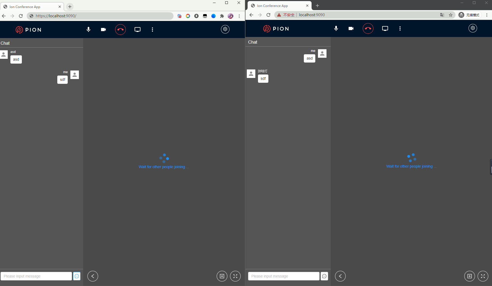
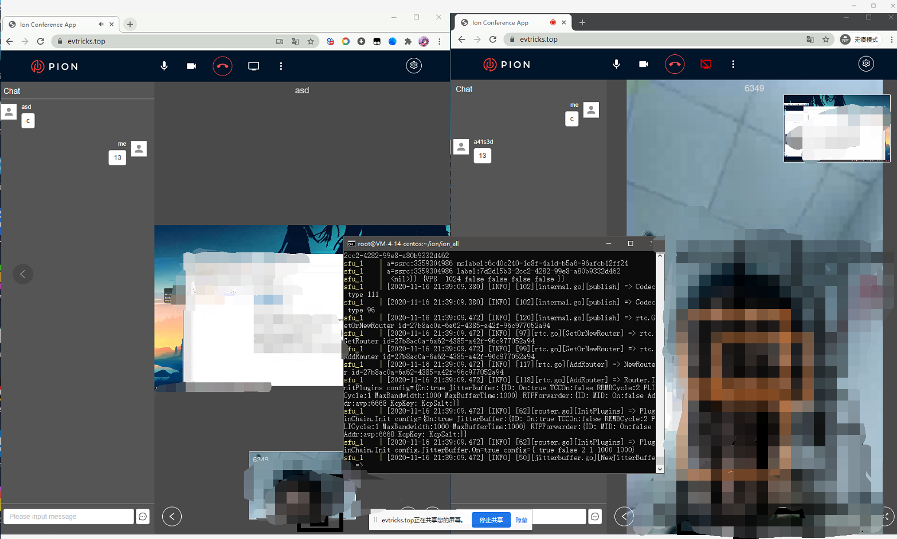
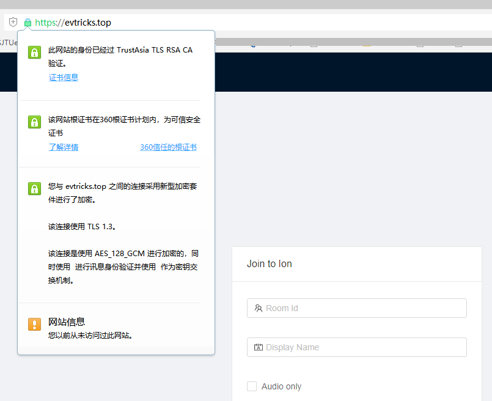

# 在自己的电脑上安装ION

按照课程pdf中的进行即可，不过要记得在docker-compose up之前要开启docker服务（桌面端或者命令行都行）

通过docker-compose up -d可以使用detach功能，可以一个窗口开启多个容器服务。

中间遇到一个情况是5353端口总是被我的浏览器占用，一种方法是查找端口占用的程序并关闭进程。
另一种方法是修改`docker-compose.yml`和`sfu.toml`中的sfu端口。

# 将ION部署到公网

### 网址是[evtricks.top](https://evtricks.top)

### &nbsp;&nbsp;&nbsp;&nbsp;&nbsp;&nbsp;网址是[evtricks.top](https://evtricks.top)

### &nbsp;&nbsp;&nbsp;&nbsp;&nbsp;&nbsp;&nbsp;&nbsp;&nbsp;&nbsp;&nbsp;&nbsp;网址是[evtricks.top](https://evtricks.top)

 

怎么访问都可以，已经设置了重定向为https链接。**~~ev就是我名字的字母发音XD~~**

使用的是腾讯云服务器（免费一个月），还有1元/年的域名+解析+SSL证书服务。
第一次在外网服务器搭建网站，过程还是相当曲折的，我把过程就记录到了[博客](https://www.cnblogs.com/smileglaze/p/13991905.html)里，在11月22日之后就可以访问了。
最终效果如图，电脑没有摄像头，开了两个浏览器窗口，再加上一个手机浏览器访问的画面。

由于不熟悉caddy，这个ssl证书该怎么解决也花了些功夫。

# 实现ION中的SFU级联功能

> 目前官方尚未实现sfu-sfu relay的功能，作者说实现了后会给sfu加DaemonSet的配置。

个人认为是在islb上根据用户所在ip位置分配对应的附近的sfu提供服务，用户将视频流发布至此sfu上。islb会根据其他接入用户的ip位置判断与推流用户是否在同一区域，如果不在同一区域，会通知sfu把视频流推送至对应区域的sfu，与此同时在该区域的服务器端创建一个route，作为中继的publisher，该区域的用户可以订阅这个推流用户来订阅视频。

因为rtc服务具有时间上集中的倾向（比如工作时间的在线教学、开会），sfu级联应当考虑到动态扩展、快速部署的功能，这样可以在夜间时间启用较少的sfu节约资源，可以通过单节点的Docker化实现。
